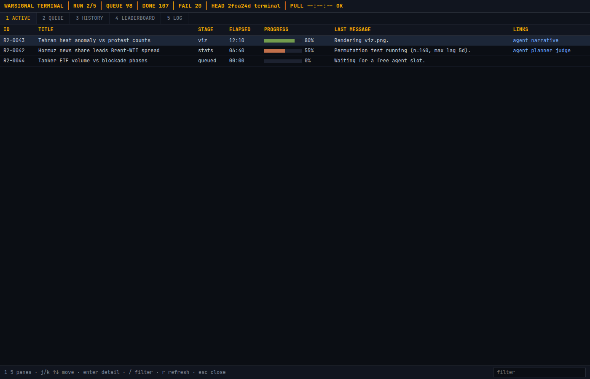

# WarSignal

WarSignal is an alternative-data hypothesis lab for the Voloridge HackMIT
“Signal in the Noise” challenge. It combines public news, weather, air
quality, research, materials, energy, events, and market data into registered
indicators, then tests hypotheses with aligned correlations, lag searches,
permutation tests, event studies, and pre/post comparisons. Every mission
leaves a JSON/Markdown report and can produce an interactive Pygame chart.

## Quickstart (60 seconds)

```bash
python -m venv .venv
source .venv/bin/activate
pip install -r requirements.txt
cp .env.example .env
python main.py fetch --quick
python main.py mission "Iran news volume leads Brent crude returns" --viz
python main.py ui
python main.py queue --n 5
```

### Brain backends

WarSignal uses Devin child sessions as the default brain for planner
reasoning, narrative notes, and visualization design/code generation. Put
`DEVIN_API_KEY` in `.env`, then find the mission sessions at
`https://app.devin.ai` by filtering for the `warsignal` tag. Each session is
also tagged with its purpose and mission ID. If Devin is unavailable, WarSignal
logs the fallback and uses OpenAI; select a backend explicitly with
`--brain devin`, `--brain openai`, or `--brain heuristic` on `mission` and
`queue`. The heuristic option disables LLM calls.

### Mission protocol

Every mission writes a self-contained, reproducible folder under
`missions/runs/` containing its hypothesis, plan, statistics, judge response,
aligned/raw data, narrative, manifest, and (when requested) `viz.png`.
`missions/runs/INDEX.md` is regenerated after each mission. Use
`--publish` with `mission` or `queue` to commit the run folder and index and
push them to the current branch; publishing is off by default.

Network fetches are optional after raw data and indicator caches exist. Never
commit `.env`, downloaded data, reports, or mission result CSVs.

## Entrypoint

| Command | Purpose |
| --- | --- |
| `python main.py fetch --quick` / `--all` | Fetch configured public datasets |
| `python main.py indicators [--source X]` | List the indicator catalogue |
| `python main.py mission "..." [--no-ai] [--brain X] [--dry-run] [--viz] [--show]` | Plan or run one mission |
| `python main.py queue [--n N] [--no-ai] [--brain X] [--viz]` | Run queued hypotheses |
| `python main.py queue --reset` | Restore `missions/queue.txt` from its backup |
| `python main.py queue --requeue-failed` | Put failed hypotheses back in the queue |
| `python main.py viz M... [--headless]` | Render a mission visualization |
| `python main.py ui [--port 8000]` | Start the Flask hypothesis interface |
| `python main.py graph [--port 8010] [--charts-port 8011]` | NL prompt → pygame chart web UI + launcher |
| `python main.py selftest` | Check keys, judge availability, and indicator loading |
| `python main.py kingdom [--scale N] [--scene S] [--screenshot out.png]` | Pixel-art mission dashboard (see [Kingdom](#kingdom)) |
| `python main.py terminal [--port 8020] [--no-pull] [--snapshot out.html]` | Bloomberg-style mission monitor web UI (see [Terminal](#terminal)) |

## Terminal

Terminal is a Bloomberg-style web monitor (dark monospace, dense tables,
keyboard navigation — no frameworks, no game art) over the same `missions/`
data: active agents, the hypothesis queue, run history with scores, a
validity leaderboard, and a status-change log. It `git pull --rebase
--autostash`es every `--pull-interval` seconds (default 60; `--no-pull`
disables) so it tracks GitHub main.



```bash
python main.py terminal                       # http://127.0.0.1:8020
python main.py terminal --no-pull --snapshot snap.html   # static HTML export
```

Keys: `1`-`5` switch panes, `j`/`k`/arrows move, `Enter` opens the run detail
pane, `/` filters, `r` forces a refresh, `Esc` closes. Details and the
`/api/state` shape live in `terminal/README.md`.

## Kingdom

Kingdom is a calm 8-bit pixel-art dashboard that turns the `missions/` folder
into a living fortress: one worker hut per active mission, a monument per
completed run, and a great hall with menus for current, queued, and completed
missions (click the castle or press Enter; Esc walks back out).

```bash
python main.py kingdom                      # windowed, 3x upscale of a 480x270 canvas
python main.py kingdom --scale 2 --scene completed
python main.py kingdom --screenshot kingdom.png   # headless render for CI/tests
pytest tests/test_kingdom_*.py -q
```

It is read-only, polls `missions/` every ~2 s, and disables audio. Details,
controls, and the asset pipeline live in `kingdom/README.md`.

## Architecture

```text
public sources
     │
     ▼
fetchers/raw manifests ──► indicators/register + cache
                                  │
                                  ▼
mission engine
  planner (gpt-5.1 or heuristic)
      └── stats (align, transforms, lags, permutations, events)
              └── judge (Jev → OpenAI fallback → heuristic)
                      └── narrative
                                  │
                                  ▼
             missions/results.csv + reports/*.json|*.md + viz/*.png
```

## Data sources

| Source | Coverage used | Limitation |
| --- | --- | --- |
| GDELT v1/v2 and GKG | Daily window from 2025-03 through current data | News volume and tone are proxies; source coverage changes |
| Open-Meteo | 19 cities, daily weather through archive latency | Forecast/archive revisions and seasonal confounding |
| NOAA ISD | 2025-03 through 2025-08 station observations | ISD-only series stop in 2025-08; station and field coverage vary |
| OpenAQ | Cities with indexed locations and downloaded rows | API requires a key; S3 archive coverage is uneven |
| Open-Meteo CAMS | 19 cities, 2025-03 through archive latency | Model reanalysis, not ground sensors; spatial smoothing and revisions |
| Crossref | Weekly publication counts/shares from 2025-03 through current week | Query totals are bibliographic matches, not full-text prevalence or causal output |
| OpenAlex | Sparse S3 sample (about 8 weekly observations) | Not suitable for dense time-series missions; prefer Crossref |
| Materials Project | Static document/materials snapshot | Not a daily research-timing series; use Crossref for publication timing |
| PUDL/EIA | Demand, generation, fuel, and generator tables | Publication and revision delays; regional aggregation choices |
| Yahoo Finance/FRED | Daily market prices and selected macro series | Trading calendars, symbol semantics, and vendor revisions |
| Iran timeline | Curated dates in `data/reference/iran_timeline.csv` | Event selection is curated and not exhaustive |

## Statistical caution

WarSignal reports associations, not causal effects. Always inspect sample size,
coverage, the common war shock, seasonal structure, multiple lag tests, and
plausible common causes before treating a result as evidence.

## Graph reels

`python main.py graph [--port 8010] [--charts-port 8011]` starts a small web UI
for natural-language charts and a `charts.py` pygame launcher window manager.

- Type a prompt ("the instagram reels of the price of brent"); the planner maps
  it to registered indicators (or external yfinance/FRED symbols when nothing
  fits), writes a `graphs/YYYYMMDD-NNN-<type>_<slugs>/` folder, renders
  `thumbnail.png`, commits the folder + `graphs/INDEX.md`, and pushes — each
  graph folder is a shareable, committed artifact.
- `chart.py` defaults to a deterministic reference template; the planner sets
  `needs_custom_code` only for requests outside reel/line/spread/scatter
  (histograms, dual-axis, candlesticks…), in which case gpt-5.1 adapts the
  template under strict "change as little as possible" rules with validator and
  render-repair fallbacks back to the template. `plan.json` records
  `codegen: template|llm|llm-repaired|template-fallback`.
- Chart types: `reel` (animated day-by-day playback), `line`, `spread`, and
  `scatter` (with OLS fit and `r=` readout).
- Reel controls: Space play/pause, ←/→ scrub (hold to repeat), ↑/↓ speed,
  Home/End, R restart, S screenshot, Q/Esc quit. Static charts support hover
  readouts, S, and Q.
- Repeat prompts reuse cached folders (fuzzy match ≥0.92 auto-hits; borderline
  matches are confirmed by gpt-5-mini). Cached charts with stale CSVs are
  refreshed before launch.
- Safety: generated `chart.py` is AST-validated — only pygame/pandas/numpy and
  stdlib modules are importable, no network/file-writing calls; renders happen
  in a subprocess via `charts.py`.
