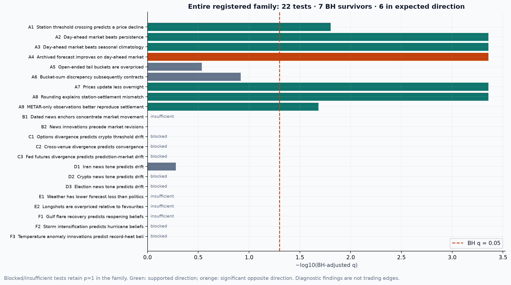
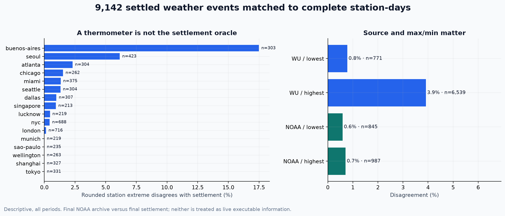
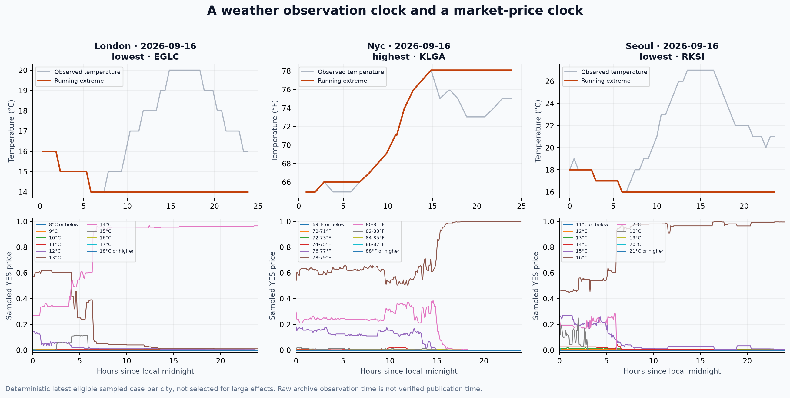
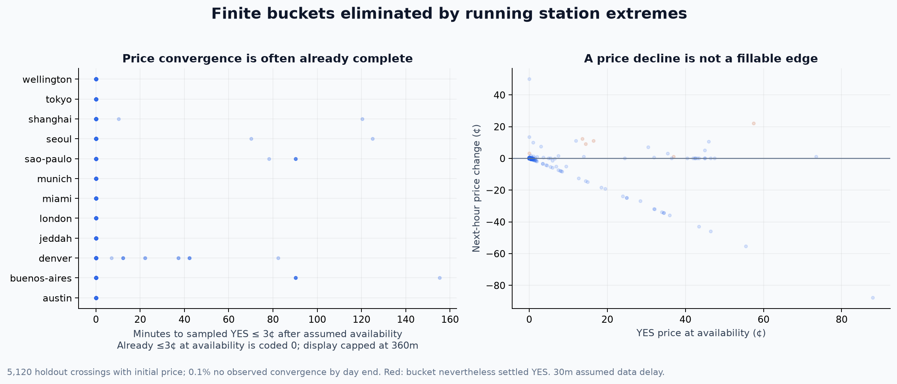
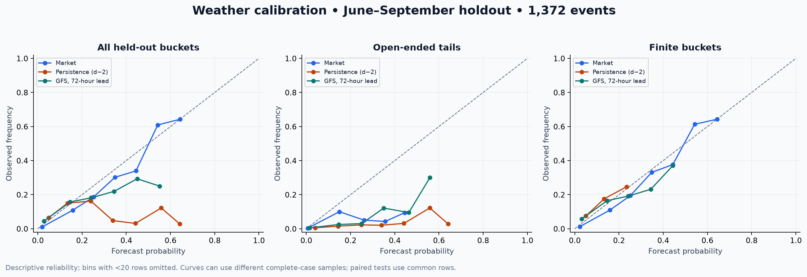
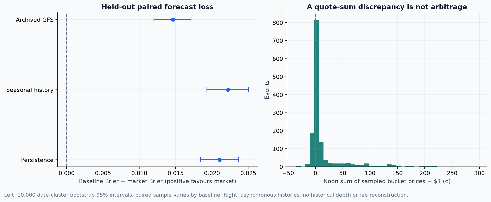
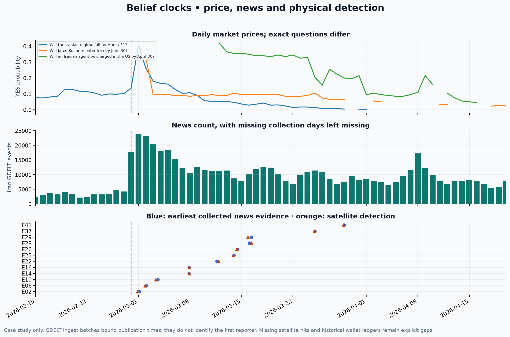
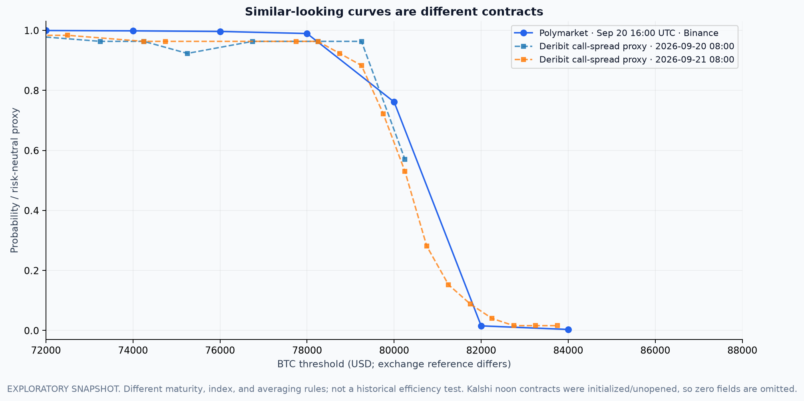
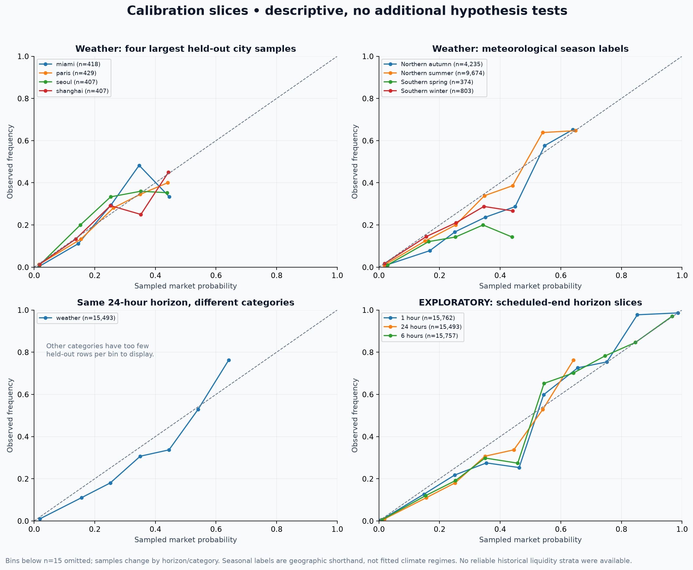

# P2 — Polymarket as a dataset

Generated 2026-09-20T07:35:31.448792+00:00. AI-assisted public-data research for HackMIT; no investment advice, accounts, identity linkage or orders.

## Primary result and full search accounting

**7 of 22 preregistered tests survive Benjamini–Hochberg at q ≤ 0.05; 6 also have the expected direction. 11 tests were estimable. No executable market inefficiency is established.** The most useful distinction is between forecast quality, response to a station proxy, and the contract’s actual resolution source.

**Weather prices generally absorbed the obvious physical information already:** 98.77% of 5,120 holdout crossings with an initial price were already at or below 3¢. The next-hour mean decline was only **0.078¢** (A1 q=0.0158), smaller than even a one-cent illustrative all-in cost. That is a small statistical response, not a validated profit opportunity.

Market Brier loss was lower than persistence by 0.0211, seasonal history by 0.0222, and the conservative 72-hour-offset GFS baseline by 0.0146. A4 therefore significantly contradicts its forecast-beats-market hypothesis. This does **not** show that markets beat the best forecast available at the cutoff: the GFS baseline intentionally uses older runs to guarantee temporal separation.

The weather source audit matched **9,142 settled events across 41 cities** with complete local-day observations. Rounded station extremes disagreed with settlement in **3.00%** of these events. A disagreement is evidence that these sources/aggregation rules are not interchangeable, not evidence that either source is wrong.

The price sample contains **2,400 events** selected by a frozen, outcome-independent hash within city/month/max–min strata. 1,372 holdout events have at least one valid noon-day-ahead forecast price; the paired baseline samples differ. The complete family, including blocked and insufficient tests, is below.

| test_id | status | n | n_dates | effect | lo | hi | p | q | supported |
| --- | --- | --- | --- | --- | --- | --- | --- | --- | --- |
| A1 | tested | 954 | 110 | -0.0007804 | -0.0013382 | -0.00029226 | 0.0042996 | 0.015765 | True |
| A2 | tested | 943 | 110 | -0.021051 | -0.023654 | -0.018417 | 9.999e-05 | 0.00043996 | True |
| A3 | tested | 957 | 110 | -0.022208 | -0.025029 | -0.019291 | 9.999e-05 | 0.00043996 | True |
| A4 | tested | 943 | 110 | 0.014627 | 0.012021 | 0.017117 | 9.999e-05 | 0.00043996 | False |
| A5 | tested | 1372 | 110 | -0.0052109 | -0.01188 | 0.0013826 | 0.11949 | 0.29208 | False |
| A6 | tested | 1431 | 110 | -0.0033756 | -0.0066645 | -0.00013153 | 0.043996 | 0.12099 | False |
| A7 | tested | 1433 | 110 | -0.010186 | -0.012089 | -0.0082211 | 9.999e-05 | 0.00043996 | True |
| A8 | tested | 5081 | 109 | -0.16295 | -0.17349 | -0.15196 | 9.999e-05 | 0.00043996 | True |
| A9 | tested | 5081 | 109 | -0.0073399 | -0.012993 | -0.0031975 | 0.0065993 | 0.020741 | True |
| B1 | insufficient | 20 | 20 | 0.0068003 | -0.0068516 | 0.024465 | 1 | 1 | False |
| B2 | tested | 156 | 156 | -0.042803 | -0.19861 | 0.11511 | 0.87151 | 1 | False |
| C1 | blocked | 0 | 0 | — | — | — | 1 | 1 | False |
| C2 | blocked | 0 | 0 | — | — | — | 1 | 1 | False |
| C3 | blocked | 0 | 0 | — | — | — | 1 | 1 | False |
| D1 | tested | 157 | 157 | 0.091177 | -0.066412 | 0.24433 | 0.23878 | 0.52531 | False |
| D2 | blocked | 0 | 0 | — | — | — | 1 | 1 | False |
| D3 | blocked | 0 | 0 | — | — | — | 1 | 1 | False |
| E1 | insufficient | 7 | 7 | -0.029301 | -0.16881 | 0.05654 | 1 | 1 | False |
| E2 | insufficient | 24 | 24 | -0.044916 | -0.05765 | -0.0324 | 1 | 1 | False |
| F1 | insufficient | 23 | 23 | — | — | — | 1 | 1 | False |
| F2 | blocked | 0 | 0 | — | — | — | 1 | 1 | False |
| F3 | blocked | 0 | 0 | — | — | — | 1 | 1 | False |

Effect units: A1 probability change; A2–A4 binary Brier-score differences; A5 calibration-residual difference; A6 change in absolute bucket-sum discrepancy; A7 absolute hourly-price-change difference; A8–A9 mismatch-rate difference; B1 absolute-return difference; B2/D1/F1 correlation of changes. Diagnostic tests A8/A9 are not market-inefficiency tests. Significant effects in the opposite direction reject the directional hypothesis.



## Preregistration, timing and reproducibility

Preregistered 2026-09-20T06:57:51.109621+00:00; SHA-256 **66078147538650598444da4f25b34006d6231ce55beffbe6fa89665ee17bea26**. `prereg.json` was written before price-history access or hypothesis testing and has not been rewritten. `prereg_transport_amendment.json` permits only the documented read-only batch-history POST (up to 20 token IDs) and smaller equivalent NOAA Parquet downloads; it was recorded before testing. No test, expected sign, horizon or family membership changed.

Weather: train through 2026-05-31, holdout 2026-06-01 through 2026-09-18. Date-level clustering retains all buckets and cities on one date together; the reported mean weights dates equally after within-event averaging where applicable. 10,000 centered date-bootstrap null draws, percentile intervals, BH over all 22 slots, blocked/insufficient p=1. Seven-day moving-block intervals are secondary robustness fields in results.csv, not extra confirmatory tests. Non-weather series use the first 60% of overlapping dates to select any lag, then the last 40% to score; the permutation null takes the maximum over registered lags.

Inference requires at least 30 held-out dates and 50 units for mean tests, or 60 held-out dates for correlations. Small-sample case studies remain descriptive. The 80%-power MDE is reported for estimable nulls in `results.csv`; it is an approximate independent-date calculation and may be optimistic under serial dependence. Family-conservative MDE additionally uses a Bonferroni critical value. Unavailable samples have undefined MDE, not zero effect.

Placebo false-positive rate: **0/11 = 0.0%** at unadjusted p<0.05. One prespecified sign-randomized date-effect placebo per executable paired test (28-day signal shift for executable correlation tests); this small, dependent placebo battery is a diagnostic, not precise proof of nominal size.

The inherited environment uses a folder-local Python 3.12 venv. Docker was attempted but its daemon did not respond; no host system packages were installed. `Dockerfile`, `requirements.txt`, and `requirements-lock.txt` provide reproduction options. All writes are inside this folder, including caches and this folder’s `.agent/CONTINUITY.md`.

```sh
# Reuse existing crawls; never rerun fetch_gamma.py
.venv/bin/python prepare.py
.venv/bin/python fetch_ghcnh.py
.venv/bin/python acquire.py probes
.venv/bin/python acquire.py weather
.venv/bin/python acquire.py forecasts
.venv/bin/python acquire.py access
.venv/bin/python acquire.py other
.venv/bin/python stations.py
.venv/bin/python weather_panel.py
.venv/bin/python other_panel.py
.venv/bin/python baseline_panel.py
.venv/bin/python physical_panel.py
.venv/bin/python cross_venue.py
.venv/bin/python analyze.py
.venv/bin/python publish.py
.venv/bin/python validate.py --artifacts
```

`register.py` is a one-time freeze command and refuses to overwrite. API access is separate from offline analysis. Current snapshot acquisition for cross-venue comparison is recorded in the response manifests; replaying analysis requires no network. Original request bodies, status codes, timestamps, retry history and response hashes are cached. Negative responses are cached too. Analysis must be rerun only after all selected-token acquisition completes.

## Data access, provenance and coverage

| Source | Access observed | Coverage / limitation |
|---|---|---|
| Weather Gamma crawl | Existing local crawl reused | 140,128 bucket rows; no recrawl |
| General Gamma crawl | Frozen existing-file snapshot | 279,100 unique markets; contrary to handoff, writer/cursor still active at inspection; no new crawl launched |
| CLOB history | HTTP 200, public GET and read-only batch POST | Explicit ≤7-day windows, five-minute weather sampling / hourly general sampling; interval=max misleading for older markets |
| NOAA GHCNh | Official keyless PSV/Parquet | 43 matched stations; 15 ICAOs absent from supplied station list, no guessed substitution |
| Open-Meteo previous runs | Keyless HTTP 200 | GFS temperature_2m_previous_day3; all target hours forecast at least 72h earlier, safely before day-ahead noon |
| GDELT | Existing local Parquet reused | Sparse sampled days; Iran country-event tone available, crypto/election tone absent; no DOC API calls |
| NASA VIIRS | Existing local GIBS Parquet reused | 2025-only frozen hotspot map for 2026; 48h assumed dissemination lag, no vintage guarantee |
| Kalshi | Keyless public HTTP 200 | Market metadata and historical cutoff work; same-noon BTC contracts initialized/unopened; no historical identical-contract panel |
| Deribit / Coinbase | Keyless public HTTP 200 | Current option summaries / spot work; historical exact-expiry digital panel not reconstructed |
| CME FedWatch | HTTP 403 | Server reports IP scraping block; respected, no workaround or account |
| P1 wallet engine | Sibling read-only inspection | Conservative ledger exists; audit sample ends June 2023 and is incomplete; no valid 2026 historical-profit attribution |

Observed history-probe results:

| era | variant | requests | nonempty | points |
| --- | --- | --- | --- | --- |
| early | explicit | 10 | 10 | 7823 |
| early | max | 10 | 0 | 0 |
| late | explicit | 10 | 10 | 7499 |
| late | max | 10 | 8 | 496 |
| middle | explicit | 10 | 9 | 7966 |
| middle | max | 10 | 0 | 0 |

The apparent historical-access failure under interval=max was resolved by explicit start/end timestamps on the same tokens. Monthly five-minute batch requests returned HTTP 400 (“interval is too long”); daily event groups with six-day windows succeeded. Failed requests remain cached; they were never treated as price observations.

The general catalogue is a retrospective closed-market universe selected by final lifetime volume ≥$10,000. That is not a point-in-time investable screen. Its B/D/E comparisons apply only to this selected cohort; no volume-based historical signal is constructed. General-market endDate comes from the final cached metadata and is not guaranteed to be the date announced at creation. E’s horizon labels therefore remain metadata-based diagnostics, with no executable timing claim. Weather uses the explicit local date in the contract event slug.

## A — Weather-market efficiency

### Contract/source audit

| source_family | bucket_rows | events |
| --- | --- | --- |
| NOAA | 36773 | 3343 |
| WU | 99625 | 9588 |
| other | 3730 | 340 |

The other 29% in the handoff are mostly NOAA weather.gov station time-series URLs. The original station parser only recognized final path segments; `prepare.py` also parses the `site=` query parameter. Non-airport Hong Kong Observatory and Taiwan CWA records remain distinct. The catalogue contains source changes and station changes within cities; the analysis joins station plus date, never just city.

| status | events |
| --- | --- |
| audited | 9142 |
| incomplete_day | 142 |
| no_station_day | 3591 |
| unresolved_or_invalid_partition | 395 |

| source_family | kind | events | rounded_disagreement | raw_disagreement |
| --- | --- | --- | --- | --- |
| NOAA | highest | 987 | 0.0070922 | 0.14387 |
| NOAA | lowest | 845 | 0.0059172 | 0.17988 |
| WU | highest | 6539 | 0.03915 | 0.21242 |
| WU | lowest | 771 | 0.0077821 | 0.15435 |

NOAA temperatures are converted into contract units before floor(x+0.5) rounding. Whole-unit bucket classification is compared with a deliberately unrounded baseline; improvement from rounding is a mechanical source-compatibility diagnostic, not a novel forecasting effect. Only complete days with ≥18 observed local hours, earliest hour ≤02, latest ≥21 enter the final settlement audit. FM15/FM16-only comparisons require both subsets complete. DST is respected. Exact half-unit ties and full precision near boundaries can matter; no WU daily-page extraction was used to adjudicate residual disagreements.



### Intraday timing

Only elimination of finite buckets is treated as monotone certainty: a running high crossing the upper bound, or a running low crossing the lower bound. A finite apparent winning bucket is never declared certain before midnight. Observations are shifted 30 minutes as a prespecified availability assumption; the archive does not certify that assumption. The price response is measured on the subsequent 60 minutes using only as-of prices ≤15 minutes old. Missing quotes are missing, never terminal-price backfills.

5,140 held-out bucket crossings were reconstructed, covering 955 events; 6 of those apparently eliminated buckets nevertheless settled YES. The primary A1 average includes such contradictions rather than selecting them away. Delay summaries are descriptive; an already-low price is delay zero and a bucket never reaching 3¢ by local midnight is right-censored. Missing initial quotes are excluded from the displayed delay distribution.





### Day-ahead probabilities and biases

The forecast cutoff is noon on the previous local day. Yesterday’s completed maximum is unavailable at that cutoff, so persistence starts from day d−2 and adds the early-period empirical distribution of two-day changes. Seasonal history uses ±30 calendar days of the target season, with past dates only and at least 30 observations; it is a short-history seasonal baseline, not a 30-year climate normal. GFS previous_day3 values are deliberately conservative: every target-day hour is issued before the cutoff. Early residual distributions turn forecast extremes into bucket probabilities; no realized target-day observations enter predictions.

Brier scores are computed bucket by bucket, averaged within events, then by date. Paired samples differ across baselines; reliability curves are descriptive and can have different coverage. A5 contrasts open-ended and finite-bucket outcome-minus-price residuals. A6 tests contraction of bucket-sum deviations; A7 compares local night/day absolute hourly changes. None uses price-level correlations as evidence of prediction.





### Spread, fees and realistic size

Historical CLOB prices are sampled prices, not certified midquotes or bid/ask depth. Only 7 representative current weather books had both sides. Their spreads range from 1.00¢ to 94.00¢; 2/7 showed at least $100 of displayed ask value within one cent of the best ask. This is a depth audit, not an order simulation or a promise of fills.

| city | bid | ask | spread | ask_dollars_within_one_cent | raw_fee |
| --- | --- | --- | --- | --- | --- |
| amsterdam | 0.03 | 0.96 | 0.93 | 57.18 | {"base_fee": 1000} |
| ankara | 0.42 | 0.47 | 0.05 | 98.35 | {"base_fee": 1000} |
| atlanta | 0.4 | 0.41 | 0.01 | 24.7 | {"base_fee": 1000} |
| austin | 0.52 | 0.53 | 0.01 | 116.78 | {"base_fee": 1000} |
| buenos-aires | 0.03 | 0.97 | 0.94 | 113.14 | {"base_fee": 1000} |
| chicago | 0.4 | 0.68 | 0.28 | 4.25 | {"base_fee": 1000} |
| dallas | 0.44 | 0.46 | 0.02 | 4.6 | {"base_fee": 1000} |

Fee-rate responses are preserved verbatim, because a current per-token parameter cannot establish past fees and should not be silently equated with a universal percentage. Current documentation describes category-dependent, price-dependent taker fees. No historical spread, depth or fee series was obtained. Thus even a significant response or calibration defect remains **historically unverified after costs**. Bucket-sum deviations can arise from asynchronous stale samples and cannot be called arbitrage.

| illustrative_all_in_cost_cents | gross_subsequent_decline_cents | decline_minus_assumed_cost_cents |
| --- | --- | --- |
| 1 | 0.07804 | -0.92196 |
| 2 | 0.07804 | -1.922 |
| 5 | 0.07804 | -4.922 |

The table is arithmetic on the measured average subsequent price decline, not a simulated order or realized P&L. Costs include spread/fees/slippage only by illustrative assumption; a short position, entry/exit fill and feasible historical depth were not established. All three assumed cost levels exceed the measured average decline.

## B — Belief clocks

Iran timeline anchors are dates, not verified first-news instants; B1 compares absolute daily price changes in 24-hour windows on either side of UTC day boundaries. B2 uses changes in Iran GDELT counts and future market returns after the full news day is complete. The 1/2/3-day lag selection occurs only in the early period, with a max-statistic permutation null. The case figure aligns actual cached prices, daily news counts and the sibling’s satellite observations on a shared axis.

Earliest collected GDELT batches are upper bounds on publication time, not proof of first public knowledge. Some “ceasefire” keywords matched Ukraine/Gaza contracts; Iran primary panels require explicit Iran/Hormuz wording. General Fed, hurricane, election and outage markets were acquired, but a defensible exact-timestamp matched event panel was not built for those categories. They are access/coverage extensions, not extra unregistered statistical claims.

The P1 ledger was inspected rather than rebuilt. Its accessible audited sample did not establish historical wallet positions and profitability for the 2026 event panel; no wallet is labelled informed or profitable from today’s snapshot. Public addresses were never linked to identities.



## C — Finance-native comparisons

A targeted current Bitcoin event lookup initially returned the previous year’s yearless slug. The explicit 2026 slug was fetched and the date checked; the old response is retained only as provenance. Polymarket’s Sep 20 noon ET threshold uses Binance BTC/USDT candle close. Kalshi’s same nominal time uses a 60-second CF Benchmarks BRTI average and was still initialized, with zero displayed quote fields and zero size. Those zeros were correctly treated as unavailable, not a 100-point mispricing.

The chart compares live Polymarket quote bands with a descriptive Deribit call-spread digital approximation, converting BTC-denominated premiums using the contemporaneous index price. Expiries and settlement definitions differ; invalid approximations outside [0,1] are omitted, not clipped into valid probabilities. No same-contract historical comparison or lead/lag test is claimed. Kalshi NYC daily weather references CLINYC, whereas the Polymarket NYC contracts in this catalogue resolve at KLGA; same city does not mean same payoff. CME’s explicit 403 scraping block was respected.



## D — News tone and later drift

Iran tone is daily IRN.tone_sum / IRN.events, then first-differenced. The target is the following completed market-return day, after the source news day could have been known. No missing news days are filled with zeros. The cached file does not contain crypto or election tone; D2 and D3 are blocked, not null. Mixed YES question directions and country-level topic breadth limit interpretation even for an estimable D1.

## E — Known baselines

The primary baseline panel uses exactly 24h before each original scheduled endDate, excludes known prior closures, and never substitutes the weather noon-day-ahead panel for that horizon. Weather-versus-politics loss is a compositional comparison, not evidence that physical quantities are intrinsically easier. Favourite–longshot residual differences use the fixed ≤10% and ≥90% cutoffs. Clearly exploratory reliability slices at 7 days, 6 hours and 1 hour add no hypothesis tests, optimized horizons or confirmatory claims. Final lifetime volume is not a valid historical liquidity measure, so it is labelled audit metadata only; historical liquidity-conditioned reliability remains untested.



## F — Physical signals on the same question

The sibling flare series selected persistent cells using all years, including future observations. This run instead freezes cells lit on ≥5% of available 2025 dates, then measures 2026 log1p daily FRP changes in the Gulf/Basra region. Completed-day signals are delayed a further 48h before subsequent 1/2/3-day price-return windows. The physical proxy is closer to the question than a broad commodity price, but clouds, fires and source revisions still confound it. F1 retains the preregistered minimum held-out sample requirement.

Only two actual hurricane contracts and three record-heat contracts survived semantic screening. A Carolina Hurricanes hockey market and a speech-mentions market about the word “Hottest” were excluded as keyword false positives. No defensible named-storm/station alignment or publication-vintage global temperature-anomaly estimate was reconstructed; F2/F3 remain untested. Final revised anomalies are not silently used as historical signals.

## Nulls, blocked claims, and tested versus believed

| test_id | status | verdict | mde | mde_family | note |
| --- | --- | --- | --- | --- | --- |
| A1 | tested | supported | 0.00074858 | 0.0010403 | YES price 60m minus price at station crossing+30m; no conditioning on final winner or initial nonzero price. Reconstructed observation availability; not executable latency. |
| A2 | tested | supported | 0.0037542 | 0.0052174 | Equal-event mean binary Brier difference; paired complete cases. Empirical baseline distributions use early-period data only; persistence observes d-2, forecast uses previous_day3 GFS. |
| A3 | tested | supported | 0.0040683 | 0.0056539 | Equal-event mean binary Brier difference; paired complete cases. Empirical baseline distributions use early-period data only; persistence observes d-2, forecast uses previous_day3 GFS. |
| A4 | tested | rejected | 0.0036989 | 0.0051405 | Equal-event mean binary Brier difference; paired complete cases. Empirical baseline distributions use early-period data only; persistence observes d-2, forecast uses previous_day3 GFS. |
| A5 | tested | rejected | 0.0094952 | 0.013196 | Within-event open-tail minus finite-bucket outcome-price residual; no level correlation. |
| A6 | tested | rejected | 0.004697 | 0.0065276 | All bucket histories required within 15m; sums use asynchronous last sampled prices, not simultaneous executable quotes. No arbitrage claim. |
| A7 | tested | supported | 0.002755 | 0.0038288 | Night 00-06 minus day 12-18 mean absolute hourly change, IANA local time. Information timing confounds activity interpretation. |
| A8 | tested | supported | 0.015073 | 0.020948 | Source-agreement diagnostic; lower error after rounding is not a price edge. All available matched station events, not just price sample. |
| A9 | tested | supported | 0.0069623 | 0.0096758 | Both observation subsets must have >=18 local hours. Signed effect below zero supports METAR-only advantage; mismatch remains a source-proxy comparison. |
| B1 | insufficient | partial | 0.022804 | 0.031692 | Iran date-only anchors; UTC 24h before/after, no minute lead inference. Other event types have no verified precise anchor panel in this run. |
| B2 | tested | rejected | 0.22273 | 0.30481 | Daily Iran topic changes; sparse source days remain missing. First 60% dates select lag; last 40% score, 7-day block max-stat permutation. Broad YES questions differ in direction; no causal interpretation. |
| C1 | blocked | partial | — | — | Public Deribit current option summaries accessible, but no synchronized historical same-strike/same-expiry digital panel acquired. Current snapshot is exploratory only; option settlement and Polymarket definitions differ. |
| C2 | blocked | partial | — | — | Kalshi public market data accessible. Exact payoff, resolution source and timestamp matching required; current NYC weather uses a different thermometer, so it is not an identical contract. No historical matched panel. |
| C3 | blocked | partial | — | — | CME FedWatch public page probed; no keyless historical futures-implied decision probability series reconstructed. Current pages cannot be backfilled into historical signals. |
| D1 | tested | rejected | 0.22203 | 0.30388 | Daily Iran topic changes; sparse source days remain missing. First 60% dates select lag; last 40% score, 7-day block max-stat permutation. Broad YES questions differ in direction; no causal interpretation. |
| D2 | blocked | partial | — | — | Cached GDELT file has country and Gulf-topic aggregates, no crypto tone series. No substitute topic was tested. |
| D3 | blocked | partial | — | — | Cached GDELT file has no election-specific tone series. Country-wide tone is not an election-tone substitute. |
| E1 | insufficient | partial | 0.19246 | 0.26747 | Matched calendar dates, mean weather minus politics Brier at scheduled-end minus 24h. Different outcome difficulty and event composition preclude causal category claims. |
| E2 | insufficient | partial | 0.018771 | 0.026088 | Longshot (<=.10) minus favourite (>=.90) calibration residual on same dates, fixed 24h horizon; category and terminal-volume strata descriptive. |
| F1 | insufficient | partial | — | — | 553 persistent Gulf cells fixed using 2025 only, avoiding sibling full-history selection. log1p FRP changes delayed 48h after completed observation day; next 1/2/3-day returns. No historical dissemination timestamps; archive revisions and clouds limit interpretation. Only screened Iran/Hormuz reopening/ceasefire/transit questions. |
| F2 | blocked | partial | — | — | Only two actual weather-hurricane contracts after excluding the Carolina Hurricanes hockey false positive; no validated named-storm/station/landfall alignment with historical wind observations. No arbitrary nearest station substitution. |
| F3 | blocked | partial | — | — | No publication-vintage running global temperature anomaly series; final monthly revisions cannot stand in for an available-at-the-time signal. |

“Rejected” means the registered directional claim failed the multiplicity/sign criterion in an estimable sample, not that the true effect is exactly zero. “Partial” on blocked/insufficient rows is a schema-compatible evidence-status label and is not partial statistical support. No test is silently dropped from the 22-member family. Descriptive city, season, source, case-study and cross-venue displays are exploratory; they introduce no additional confirmatory p-values.

## Best demo artifacts

- `figures/fig1_settlement_audit.png`: station-source disagreement at scale.
- `figures/fig4_intraday_cases.png`: observed running extreme and bucket-price paths.
- `figures/fig2_weather_calibration.png`: weather calibration with real baselines.
- `figures/fig7_family_overview.png`: the full search count and corrected verdicts.
- `figures/fig5_belief_clock.png`: price/news/satellite timing and its limits.
- `figures/fig6_cross_venue.png`: why apparently identical markets require contract checks.

Machine-readable: `results.csv` (one row per primary specification), `placebo_results.csv`, `findings.json` (one object per registered claim, including rejected/blocked ones), and normalized `data/*.parquet` panels. Raw source responses and HTTP manifests remain under `data/`; `scripts` are the folder’s `.py` files.

## Prior art and primary documentation

- [Polymarket historical-price API](https://docs.polymarket.com/api-reference/markets/get-prices-history) and [read-only batch schema](https://docs.polymarket.com/api-spec/clob-openapi.yaml), accessed 2026-09-20.
- [Polymarket fee documentation](https://docs.polymarket.com/trading/fees), accessed 2026-09-20; current parameters cannot be retroactively applied.
- [NOAA GHCNh](https://www.ncei.noaa.gov/products/land-based-station/integrated-surface-database): official hourly archive; source observation subsets and display precision matter.
- [Open-Meteo Previous Runs](https://open-meteo.com/en/docs/previous-runs-api): fixed lead-time offsets, unlike stitching the latest historical forecast.
- [Kalshi keyless market-data guide](https://docs.kalshi.com/getting_started/quick_start_market_data).
- [Le, 2026-02-23, domain-specific calibration dynamics](https://arxiv.org/abs/2602.19520): prior cross-domain/exchange calibration work; no novelty claim for favourite–longshot or category calibration.
- [Qin and Yang, 2026-06-02, Polymarket-v1 Database](https://arxiv.org/abs/2606.04217): ground-truth trade direction and microstructure measurement concerns; not used as a substitute historical ledger here.
